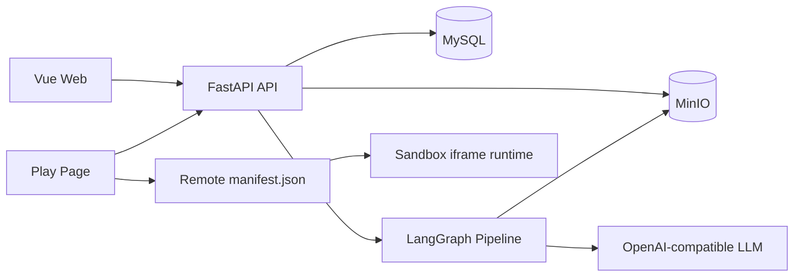
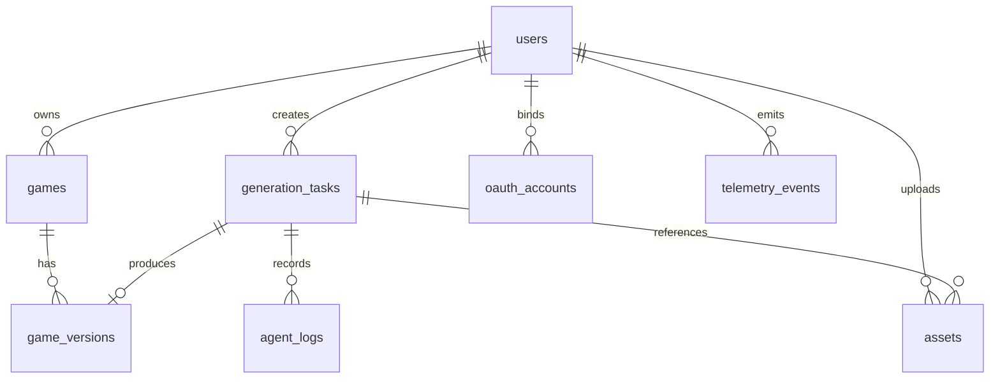
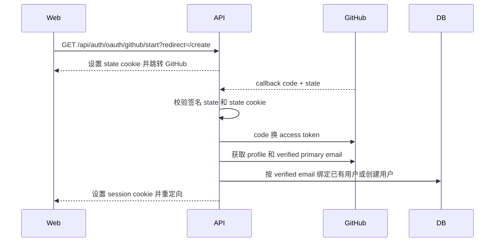

# 系统设计文档

PromptPlay AI 采用前后端分离架构，后端负责元数据、对象存储和 Agent 生成流程，前端负责 Home、Create、Play 等产品体验。

```text
Vue 3 + Vite Web
  -> FastAPI API
  -> MySQL 元数据
  -> MinIO 游戏产物和上传素材
  -> LangGraph 生成流程
  -> OpenAI-compatible 模型服务
```

## 总体架构



核心边界：

- MySQL 保存用户、OAuth 账号绑定、游戏、版本、素材、生成任务、Agent 日志和埋点事件。
- MinIO 保存上传素材和生成后的游戏文件。
- Home 只读取 `status = published` 的游戏。
- Play 先获取后端 play descriptor，再拉取远端 `manifest.json`，最后在 sandbox iframe 中加载 `entryUrl`。
- Create 创建 `GenerationTask`，后端用 LangGraph 后台执行生成流程，校验静态 bundle 后上传到 MinIO，并写入 `Game` / `GameVersion` 元数据。

## 数据模型



重要数据表：

- `users`：邮箱密码账号、展示名和头像。
- `oauth_accounts`：GitHub 第三方账号绑定；不保存 provider access token。
- `games`：游戏标题、简介、封面、标签、游玩次数和发布状态。
- `game_versions`：manifest URL、storage prefix、runtime type、生成产物快照。
- `generation_tasks`：创意 prompt、素材 id、任务状态、结果 URL、token/调用/费用指标。
- `agent_logs`：Agent 节点日志和结构化 payload。
- `assets`：上传文件元信息和 MinIO URL。
- `telemetry_events`：`request_id`、用户、事件类型、业务实体和事件 payload。

状态字段：

- `Game.status`：`draft`、`published`、`archived`。
- `GenerationTask.status`：`pending`、`running`、`succeeded`、`failed`、`canceled`。
- Home 和 Play 只暴露 `published` 游戏。

## 核心接口

认证：

```text
POST /api/auth/register
POST /api/auth/login
POST /api/auth/logout
GET  /api/auth/me
GET  /api/auth/oauth/providers
GET  /api/auth/oauth/github/start?redirect=/create
GET  /api/auth/oauth/github/callback
GET  /api/auth/oauth/google/start
```

游戏和运行时：

```text
GET   /api/games?status=published
GET   /api/games/{game_id}/play
PATCH /api/games/{game_id}
POST  /api/games/{game_id}/unpublish
```

Create：

```text
POST   /api/assets
POST   /api/generation-tasks
GET    /api/generation-tasks
GET    /api/generation-tasks/{task_id}
DELETE /api/generation-tasks/{task_id}
POST   /api/generation-tasks/{task_id}/cancel
POST   /api/generation-tasks/{task_id}/retry
GET    /api/generation-tasks/{task_id}/logs
POST   /api/generation-tasks/{task_id}/publish
```

可观测性：

```text
POST /api/telemetry/events
```

每个后端响应都会带 `X-Request-ID`。前端 API 请求也会主动发送 `X-Request-ID`。

## Auth 和 OAuth

邮箱密码登录使用 httpOnly JWT Cookie：

```text
POST /api/auth/register -> 创建 User -> 设置 session cookie
POST /api/auth/login    -> 校验密码 -> 设置 session cookie
GET  /api/auth/me       -> 从 cookie 读取 session
POST /api/auth/logout   -> 清除 session cookie
```

GitHub OAuth 已实现 demo 链路：



GitHub access token 只在 callback 中临时使用，不持久化。`oauth_accounts` 只保存 provider 身份和头像、用户名等元信息。Google 仍是计划入口，start endpoint 会重定向回登录页并提示 `google_not_configured`。

## Agent 工作流

Create 提交 `ideaText` 和可选 `assetIds`。后端创建 `GenerationTask` 后执行 LangGraph：

```text
idea_analyzer
  -> asset_interpreter
  -> game_designer
  -> code_generation_agent
  -> bundle_security_scan
  -> repair_bundle, conditional retry
  -> upload
  -> finalizer
```

节点职责：

- `idea_analyzer`：提取玩法类型、场景、难度、核心创意和素材数量。
- `asset_interpreter`：整理上传素材元信息和 URL，作为 LLM 上下文。
- `game_designer`：生成静态 Web 游戏约束和玩法设计说明。
- `code_generation_agent`：调用 OpenAI-compatible 模型，要求返回 `generated-game-bundle-v1`。
- `bundle_security_scan`：校验 schema、文件路径、文件限制和危险 API。
- `repair_bundle`：在输出不合法时要求模型修复，最多重试 `AGENT_MAX_REPAIR_ATTEMPTS` 次。
- `upload`：把生成文件和 manifest 写入 MinIO，并创建 `GameVersion`。
- `finalizer`：标记任务可预览、可发布。

每次模型调用的 usage 会聚合到 `GenerationTask.metrics`：prompt tokens、completion tokens、total tokens、模型调用次数和估算费用。

## 远端产物协议

生成游戏是静态 bundle：

```text
generated-game-bundle-v1
  index.html
  game.js
  styles.css
  data/*.json, optional
```

后端发布 `game-manifest-v1`：

```json
{
  "schemaVersion": "game-manifest-v1",
  "gameId": "...",
  "versionId": "...",
  "title": "...",
  "entry": "index.html",
  "entryUrl": "http://.../index.html",
  "assets": [
    { "name": "game.js", "url": "http://.../game.js", "contentType": "application/javascript" }
  ],
  "permissions": { "network": false, "storage": false }
}
```

Play 在以下 iframe 中运行 `entryUrl`：

```html
<iframe sandbox="allow-scripts"></iframe>
```

游戏向父页面发送：

```json
{ "type": "game.ready" }
{ "type": "game.completed", "result": "win", "durationMs": 1000 }
{ "type": "game.error", "message": "..." }
```

父页面向游戏发送：

```json
{ "type": "game.restart" }
```

## 安全方案

- Session 使用 httpOnly JWT Cookie。
- 受保护接口使用 `get_current_user`；owner-only 资源对非 owner 返回 404，避免泄露资源存在性。
- 上传文件使用 MIME 白名单和 100 MB 大小限制。
- 生成 bundle 禁止外部网络、浏览器存储、外部脚本、`eval`、`new Function`、动态 import、iframe/object/embed。
- 上传产物前进行 Pydantic schema 校验和正则安全扫描。
- 无效 bundle 会进入 repair；超过重试次数后任务失败，不发布。
- Play 使用 `allow-scripts` 的 sandbox iframe。
- `.env.example` 只放变量名和本地默认值；生产环境必须替换 secret，并使用 HTTPS 和 secure cookie。

## 失败恢复

| 场景 | 当前处理 | 后续增强 |
| --- | --- | --- |
| 上传类型不支持 | API 返回 415 | 前端预校验和更清晰提示 |
| 上传超过 100 MB | API 返回 413 | 分片上传、断点续传 |
| LLM 未配置或超时 | 任务失败并写入 `AgentLog` | 队列重试、模型 fallback |
| 生成 bundle schema 不合法 | repair 节点重试 | 保存失败样本用于回归测试 |
| 安全扫描失败 | repair 到上限后失败 | 人工审核工作流 |
| 用户取消任务 | 在节点边界变为 `canceled` | 持久化 worker 级取消 |
| 发布时产物不完整 | API 拒绝发布 | 产物修复或重建工具 |
| Play manifest 加载失败 | 显示错误 UI 和重试入口 | CDN fallback 和健康检查 |
| 已发布游戏下架 | 状态变为 `archived`，Home/Play 隐藏 | owner 私有预览入口 |

## 可观测性

已实现：

- `X-Request-ID` middleware 和前端请求 header。
- `telemetry_events` 记录用户操作、manifest fetch、iframe ready/completed/error。
- `AgentLog` 记录节点级生成进度和诊断 payload。
- `GenerationTask` 记录 token、模型调用次数、估算费用。
- `Game.play_count` 在请求 play descriptor 时自增。

典型事件：

```text
create_task_started
asset_upload_success
create_task_publish
manifest_fetch_start
manifest_fetch_success
manifest_fetch_failed
iframe_ready
game_completed
iframe_error
```

后续可增强：

- 导出 OpenTelemetry traces。
- 增加成功率、平均生成耗时、成本、失败分布 dashboard。

## 已知问题

- Demo 当前只支持本地启动，未配置公网线上地址。
- Google OAuth 只是计划入口，没有真实 callback。
- FastAPI `BackgroundTasks` 适合 demo，但进程重启时不保证任务持久化。
- 取消任务无法立即中断正在进行的 LLM HTTP 请求。
- 素材解释当前使用元信息和 URL，暂未做视频/PDF/DOCX 深度内容抽取。
- seed 游戏是确定性的 demo bundle；真实生成示例依赖 `LLM_API_KEY`。
- Play 侧部分面板仍有展示性数据，例如相关游戏和评分。
- schema 变更使用轻量运行时升级；生产环境建议使用 Alembic migrations。

