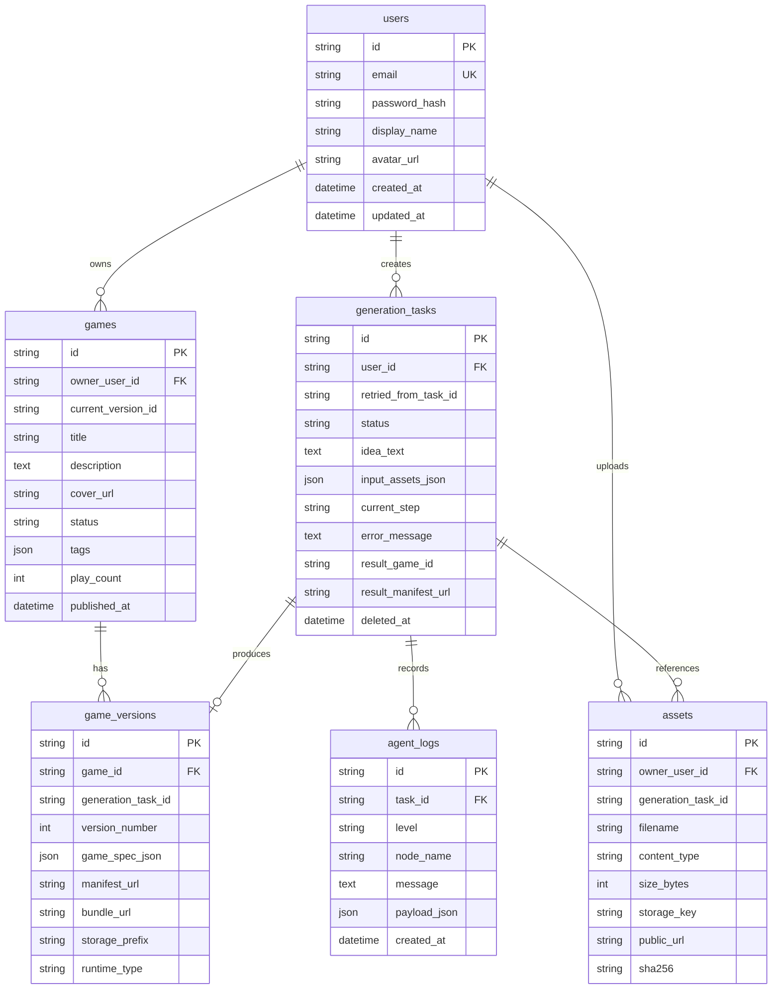
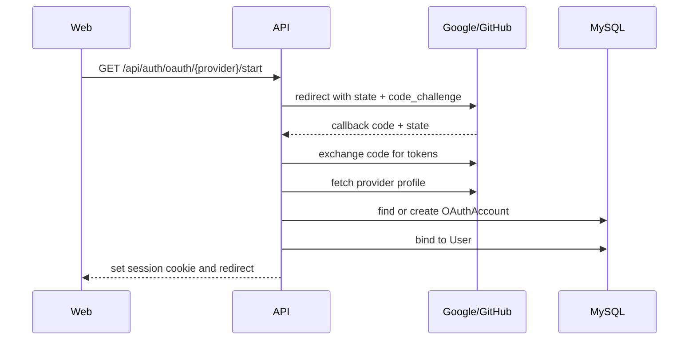

# Architecture

PromptPlay AI 采用前后端分离架构：

```text
Vue 3 + Vite Web
  -> FastAPI API
  -> MySQL metadata
  -> MinIO game artifacts
  -> LangGraph generation pipeline
```

## 核心边界

- MySQL 保存用户、游戏元信息、版本、生成任务和 Agent 日志。
- MinIO 保存上传素材和生成后的游戏 bundle。
- Play 页面只根据后端返回的 manifest URL 加载远端游戏，不硬编码本地游戏组件。
- Agent 生成结构化静态 Web 游戏文件包，后端校验后上传到 MinIO。
- 当前产物协议为 `generated-game-bundle-v1`：`index.html`、`game.js`、`styles.css` 和可选 `data/*.json`。

## 数据模型

当前数据库由 SQLAlchemy 模型驱动，核心表关系如下：



- `Game.status` 使用 `draft / published / archived` 表示发布状态；首页只查询 `published`。
- `GameVersion` 记录一次可运行产物，`manifest_url` 和 `storage_prefix` 指向 MinIO 对象。
- `GenerationTask` 是 Create 主流程的状态容器，`current_step` 对应 LangGraph 当前节点。
- `Asset` 记录上传素材元信息和 MinIO 地址，任务创建时通过 `assetIds` 引用并绑定。
- `AgentLog.payload_json` 保留节点摘要、约束、错误和安全扫描结果，供 Create 页面展示与排障。

## Auth 与 OAuth 设计

已实现的认证方式是邮箱密码：

```text
POST /api/auth/register -> 创建 User -> 设置 httpOnly JWT Cookie
POST /api/auth/login    -> 校验密码 -> 设置 httpOnly JWT Cookie
GET  /api/auth/me       -> 从 Cookie 解析 session
POST /api/auth/logout   -> 清除 Cookie
```

第三方登录目前只保留前端入口，后端尚未接入。推荐扩展方式如下：



建议新增表：

```text
oauth_accounts
  id
  user_id
  provider              # google / github
  provider_account_id
  provider_email
  access_token_ciphertext
  refresh_token_ciphertext
  expires_at
  created_at
  updated_at
```

关键策略：

- 使用 `state` 防 CSRF，生产环境使用 PKCE。
- 先按 `(provider, provider_account_id)` 查绑定账号；未绑定时按 verified email 匹配已有用户，避免重复账号。
- token 加密后存储，演示阶段也不在日志里输出 token。
- 失败回调统一跳回 `/login?oauth_error=...`，前端展示可读错误。
- Google/GitHub 可共用 `OAuthProvider` 配置和 `OAuthAccount` 模型，后续可以扩展到 Discord、Steam 等平台。

## LangGraph 生成链路

Create 页面提交 `ideaText` 和素材 ID 后，后端创建 `GenerationTask`，再由后台任务执行
LangGraph。当前图节点如下：

```text
idea_analyzer
  -> asset_interpreter
  -> game_designer
  -> code_generation_agent
  -> bundle_security_scan
  -> repair_bundle, 条件重试
  -> upload
  -> finalizer
```

- `idea_analyzer` 提取创意摘要、玩法类型、场景、难度，并加载任务关联素材。
- `asset_interpreter` 将上传素材整理成 LLM 可用的引用上下文。
- `game_designer` 生成静态 Web 游戏包约束、目标玩法、文件限制和安全边界。
- `code_generation_agent` 调用真实 LLM 生成 `generated-game-bundle-v1` JSON。
- `bundle_security_scan` 使用 Pydantic 和规则扫描校验文件路径、文件大小和危险 API。
- `repair_bundle` 在校验失败时调用模型修复 JSON，最多重试 `AGENT_MAX_REPAIR_ATTEMPTS` 次。
- `upload` 上传 bundle 和 `manifest.json` 到 MinIO，并写入 `GameVersion`。
- `finalizer` 标记任务成功，前端即可预览和发布。

每个节点都会写入 `AgentLog`，用于 Create 页面展示可读的 Agent 执行过程。

## 模型配置

后端支持 OpenAI 兼容接口，不绑定固定供应商：

```env
LLM_PROVIDER=openai_compatible
LLM_BASE_URL=https://api.openai.com/v1
LLM_API_KEY=
LLM_MODEL=gpt-4.1-mini
LLM_TEMPERATURE=0.4
LLM_TIMEOUT_SECONDS=60
LLM_MAX_RETRIES=2
AGENT_MAX_REPAIR_ATTEMPTS=2
```

没有可用 `LLM_API_KEY` 时，生成任务会失败并写入配置错误日志。系统不再提供 mock 生成 fallback。
`code_generation_agent` 会根据 `creatorIdea`、`requirementProfile`、素材上下文和设计约束生成完整静态游戏包。

## 游戏产物形态

模型返回结构化文件包 JSON：

```text
GeneratedGameBundle
  -> title / description / tags
  -> entry = index.html
  -> permissions = network false, storage false, externalScripts false
  -> files[]
     -> index.html
     -> game.js
     -> styles.css
     -> data/*.json, optional
```

后端只接受严格静态包：禁止外链、网络请求、浏览器存储、`eval`、动态 import、
`iframe/object/embed` 等危险能力。Play 仍通过 sandbox iframe 加载远端 `index.html`。

## 上传与对象存储

上传素材走 `POST /api/assets`，当前支持：

```text
image/png
image/jpeg
image/webp
image/gif
video/mp4
video/webm
application/pdf
application/vnd.openxmlformats-officedocument.wordprocessingml.document
text/plain
application/json
```

单个文件上限为 100MB。文件会写入 MinIO `uploads/{userId}/{assetId}/{filename}`，
数据库保存 `content_type / size_bytes / storage_key / public_url / sha256`。Create 任务只保存素材 ID，
Agent 节点在运行时从数据库读取素材元信息和 URL 作为引用上下文。

## 安全方案

### 认证与访问控制

- Session 使用 httpOnly JWT Cookie，前端不能直接读取 token。
- `/create` 前端路由要求登录；后端 Create、上传、发布、更新、下架接口都依赖 `get_current_user`。
- 游戏更新、任务查询、删除、发布、下架均校验资源 owner，非 owner 返回 404，避免泄露资源存在性。

### 上传素材安全

- 使用 MIME 白名单和 100MB 大小限制。
- 文件名通过 `Path(filename).name` 和字符白名单清理，避免路径穿越。
- 对象存储 key 中包含 `userId` 和 `assetId`，减少命名冲突。
- 当前只做基础 MIME 与大小校验；生产化还需要病毒扫描、图片/视频解码安全检查、敏感内容审核和私有桶签名 URL。

### Prompt Injection 与 Agent 安全

- 上传素材只作为引用上下文传给模型，不直接执行素材内容。
- `game_designer` 明确约束生成静态 Web bundle，不允许外部资源、网络请求、存储 API、`eval`、动态 import。
- `bundle_security_scan` 使用 Pydantic schema 和正则规则扫描产物，失败时进入 `repair_bundle`。
- 达到 `AGENT_MAX_REPAIR_ATTEMPTS` 后任务失败，不上传不合规产物。

### 运行时隔离

- Play 使用 `<iframe sandbox="allow-scripts">`，不启用 `allow-same-origin`、`allow-forms`、`allow-popups`。
- Manifest 权限当前固定为 `network=false, storage=false`。
- 生成产物只允许 `index.html / game.js / styles.css / data/*.json`，禁止 iframe、object、embed。
- 当前隔离仍是浏览器 sandbox 级别；生产化还应增加独立静态资源域名、CSP、COOP/COEP 和资源配额。

### 密钥与配置

- `.env.example` 只放变量名和本地默认值，`LLM_API_KEY` 留空。
- 后端支持 OpenAI-compatible base URL，模型供应商可通过环境变量切换。
- 生产环境必须替换 `JWT_SECRET`、MinIO 密钥，并使用 HTTPS 与 secure cookie。

## 失败恢复策略

| 场景 | 当前处理 | 后续增强 |
| --- | --- | --- |
| 上传文件类型不支持 | 返回 415，前端显示错误 | 按扩展名辅助提示、前端预校验 |
| 上传超过 100MB | 返回 413 | 分片上传、断点续传 |
| LLM 未配置或超时 | 任务标记 `failed`，写入 `AgentLog` | 队列重试、模型降级、成本告警 |
| bundle schema 不合法 | 进入 `repair_bundle` 修复 | 保存失败样本用于回归测试 |
| 安全扫描失败 | 最多修复 N 次，仍失败则任务失败 | 更细粒度安全规则和人工审核 |
| 任务取消 | 标记 `canceled`，轮询停止 | 真正中断长时间 LLM 请求需要队列/worker 支持 |
| 发布前产物缺失 | 拒绝发布，返回 400 | 自动检查并重建缺失对象 |
| Play manifest 加载失败 | Play 页面展示错误态和重试入口 | CDN fallback、预加载、资源健康检查 |
| 已发布游戏下架 | 状态变 `archived`，首页和 Play 不可访问 | 保留 owner 私有预览入口 |

## 可观测性

当前可观测数据：

- `AgentLog`：记录每个 Agent 节点的可读摘要、level、节点名和可选 payload。
- `GenerationTask`：记录任务状态、当前步骤、开始/结束时间、错误信息、重试来源。
- `Game.play_count`：Play descriptor 被请求时自增，用于基础游玩次数统计。
- 前端 Create 页面展示任务历史、当前步骤、进度和日志摘要。
- Play 页面展示 manifest URL、storage prefix 和 sandbox runtime 信息，便于证明资源来自对象存储。

建议增强：

- 引入结构化 request log 和 `request_id`，贯穿 API、AgentLog、前端错误提示。
- 记录用户操作事件：登录、上传、创建任务、取消、发布、进入 Play、退出 Play。
- 记录模型调用耗时、token、费用、失败原因和 repair 次数。
- 对 MinIO 上传、manifest fetch、iframe ready/completed postMessage 做埋点。
- 使用 OpenTelemetry 导出 traces，配合 Prometheus/Grafana 监控任务成功率、平均耗时和失败分布。

## 已知问题

- 第三方 Google/GitHub 登录还没有后端 OAuth 实现，目前只有 UI 入口和设计方案。
- 生成任务使用 FastAPI `BackgroundTasks`，适合 demo；生产应迁移到 Celery、RQ、Dramatiq 或独立 worker，避免进程重启丢任务。
- 取消任务只能在 LangGraph 节点边界生效，无法立即中断正在进行的 LLM HTTP 请求。
- 首页已移除前端 demo 数据兜底，演示前必须运行 seed 或通过 Create 发布足够的 `published` 游戏。
- 当前对象存储桶为公开读，便于 demo；生产环境应使用私有桶、签名 URL 或独立 CDN 权限策略。
- 上传素材已支持视频/PDF/DOCX，但 Agent 目前只消费素材元信息和 URL，没有做视频帧抽取、PDF/DOCX 文本解析或多模态模型理解。
- Play 侧部分展示数据仍为静态 UI 文案，如资源大小、加载耗时、好评率和相关游戏，后续应接真实埋点与推荐接口。
- 数据库 schema 目前依赖 `create_all` 和轻量升级逻辑，生产应使用 Alembic migration 管理。
