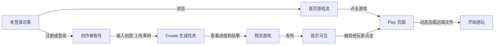

# 📍 需求说明

## 1. 需求概览

### 1.1 产品目标

面向普通玩家和互动内容创作者，搭建一个 AI Native 互动游戏平台：玩家可以发现并游玩由社区发布的互动游戏；创作者可以通过自然语言创意和多模态素材，与 AI Agent 协作生成可发布、可游玩的互动游戏。

### 1.2 用户角色

#### 玩家

- 浏览平台上的互动游戏
- 点击游戏并立即开始体验
- 看到游戏标题、封面、作者、简介和玩法提示

#### 创作者

- 登录后进入 Create 页面
- 输入创意文本并上传多模态素材
- 等待 Agent 生成可运行游戏
- 预览、发布、再次编辑或重新生成

#### 平台维护者

- 关注生成任务稳定性
- 管理游戏元信息和 OSS 文件
- 处理不安全内容、异常包和失败任务

---

## 2. PRD - 页面与功能规格

### 2.1 Auth

| 功能 | 验收标准 |
| --- | --- |
| 邮箱注册 | 用户可用邮箱和密码创建账号，失败时有明确错误提示 |
| 邮箱登录 | 用户登录后可访问 Create，刷新页面后登录态仍可识别 |
| 第三方登录 | Google 和 GitHub 需要给出完整设计，demo 阶段可以不真实接入 |
| 退出登录 | 用户可主动退出，退出后无法访问受保护页面 |

### 2.2 Home

- 展示所有 published 状态的互动游戏。
- 每张游戏卡片至少展示封面、标题、简介、作者、标签、发布时间。
- 点击卡片可进入 Play。
- 首页数据来自后端或数据库，不接受只写死在前端数组中。
- 至少有 3 个示例游戏，其中至少 1 个来自 Create 发布闭环。

### 2.3 Play

| 状态 | 页面要求 |
| --- | --- |
| 加载中 | 展示正在加载游戏文件或初始化运行环境。 |
| 加载成功 | 游戏可被用户操作，且能证明文件来自远端产物地址。 |
| 加载失败 | 展示错误原因或统一错误态，不出现白屏。 |
| 游戏结束或退出 | 提供返回首页或重新开始入口。 |

### 2.4 Create

| 能力 | 产品要求 |
| --- | --- |
| 创意输入 | 支持用户输入自然语言创意，例如玩法、风格、角色、胜负条件、参考素材用途。 |
| 多模态素材 | 支持至少一种文件、图片或视频上传；上传后能在任务中被引用。 |
| 任务进度 | 展示 pending/running/succeeded/failed 等状态，以及当前关键步骤。 |
| Agent 过程可见 | 展示可读的 Agent 日志摘要或步骤流，让面试官能判断不是单次黑盒调用。 |
| 预览与发布 | 生成完成后可预览，发布后写入 meta 并进入首页。 |

---

## 附录 - 工程交付参考

| 设计项 | 需要候选人说明 |
| --- | --- |
| 总体架构 | 前端、后端、异步任务、Agent Orchestrator、数据库、对象存储、运行时隔离如何协作。 |
| 数据模型 | 用户、游戏、版本、素材、生成任务、Agent 日志、发布状态如何建模。 |
| Agent 编排 | 是否使用 OpenClaw、Hermes、Pi Agent、LangGraph、自研状态机等，为什么这样拆分。 |
| 远端产物协议 | 生成游戏以什么文件结构、manifest 或 bundle 形式交付给 Play。 |
| 安全隔离 | 如何处理上传素材、Prompt Injection、任意生成代码执行、密钥保护和资源限制。 |
| 失败恢复 | 模型输出不稳定、构建失败、上传失败、发布失败、加载失败时如何恢复。 |
| 可观测性 | 如何记录生成过程、Agent 输入输出、用户操作、错误日志和演示证据。 |

---

## 3. 测试说明

### 3.1 产品主流程

你需要围绕两个主流程完成产品闭环：玩家从发现到游玩，创作者从创意到发布。

### 3.2 产品功能

| 模块 | 必须实现的能力 | 加分项 | 验收 |
| --- | --- | --- | --- |
| 登录注册 | 邮箱注册、邮箱登录、退出登录 | Google 和 GitHub 第三方登录需要给出数据模型、OAuth 接入设计和后续扩展方式，能真实跑通其中一个 | 成功注册/登录一个账号，查看 session 状态和受保护页面访问控制；如接入第三方登录，展示授权回调和账号绑定结果 |
| 主页 Home | 展示平台内所有已发布互动游戏；展示内容至少包含封面、标题、作者、简介、标签及发布时间；支持进入游戏详情或直接 Play | 游戏详情页、搜索、标签筛选、点赞、收藏、游玩次数统计 | 页面可浏览至少 3 个示例游戏，其中至少 1 个来自 Create 流程生成并发布 |
| 游玩 Play | 点击任意互动游戏后，根据数据库中的 meta 信息动态加载对象存储中的远端游戏文件，并在 Web 端运行 | 有对游玩 play 设计前端和后端核心业务埋点；有对游戏加载逻辑做体验和加载速度等的优化 | 不能只硬编码本地组件，需要能证明 bundle/manifest/asset 来自远端地址或本地模拟的对象存储地址 |
| 创建 Create | 实现多模态输入聊天框：文字创意输入 + 文件/图片/视频上传；后端用 Multi-Agent 架构生成互动游戏文件，上传到对象存储指定路径，并把 meta 保存到数据库 | 生成任务历史、Agent 执行日志、失败重试、版本管理、Remix 派生；安全沙箱、内容审核、资源限额、生成成本统计 | 可直接输入一个新创意，触发生成任务，看到任务进度、产物地址、数据库记录和可游玩的结果 |

### 3.3 详细交付项

| 提交项 | 是否必选 | 说明 |
| --- | --- | --- |
| 源码仓库 | 必选 | 填写 GitHub 链接，仓库需包含清晰 commit 记录（不接受少于 3 次提交） |
| Demo 地址 | 必选 | 填写线上地址；如果只能本地运行，填写完整本地启动方式 |
| 启动命令 | 必选 | 填写一条或少量命令，说明如何启动前端、后端、数据库和对象存储依赖；推荐 Docker Compose |
| 测试数据 | 必选 | 系统中需要提前存入测试的数据，至少 3 个示例游戏，其中至少 1 个由 Create 流程生成并发布 |
| 环境变量 | 必选 | 项目源码包含 .env.example，列出必需环境变量名称和用途，不要提交真实密钥 |
| 系统设计文档 | 必选 | 提交架构图、核心接口、数据模型、Agent 工作流、远端产物协议、安全方案和已知问题（推荐实现 skills，自动在项目 docs 文件夹下面自动生成） |
| 技术栈 | 必选 | 填写前端、后端、数据库、对象存储、Agent 框架、模型服务和部署方式 |
| 完成度说明 | 必选 | 说明已完成、未完成、Mock 的部分，以及如果再给 1 周会怎么迭代 |
| 测试与验证证据 | 可选 | 说明跑过哪些测试、构建、截图验证或手工验收步骤；附关键日志或截图路径 |
| 演示视频 | 可选 | 填写 5 分钟以内视频链接，可选但推荐；视频应覆盖登录、Create、发布、Home、Play |
| AI 协作记录 | 可选 | 说明使用的 AI 工具、关键 prompt、AI 贡献比例、review 和 test 方法，以及人工修复过的典型问题 |

### 3.4 不接受的交付

- 只有普通 CRUD，没有 Create Agent 生成链路
- Play 页面只运行本地写死组件，没有动态加载远端文件
- 对象存储可以用 MinIO 或 S3 兼容服务模拟，但不允许用本地文件管理替代，产品和代码边界要能无缝迁移到真实 OSS
- 所有 AI 生成过程都是固定假数据，无法解释如何扩展到真实模型或 Agent Harness
- 没有 README、无法启动、无法复现核心链路
